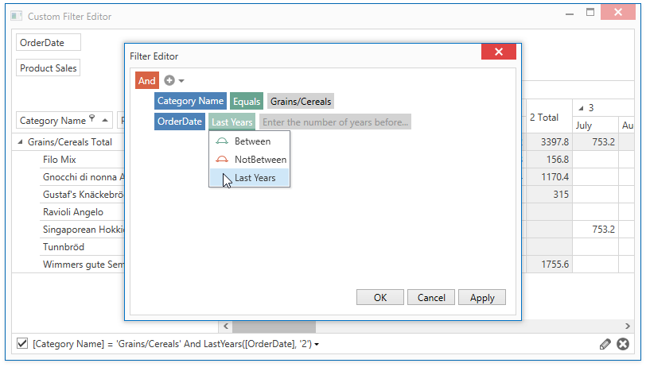

# How to Customize a Filter Editor

This example demonstrates how to customize the [Filter Editor](https://docs.devexpress.com/WPF/400733) used in WPF Pivot Grid to edit filter criteria.

to modify the list of available operators, use the following approach:

* Create a custom data template that contains the [FilterEditorControl](https://docs.devexpress.com/WPF/DevExpress.Xpf.Core.FilteringUI.FilterEditorControl) whose [QueryOperators](https://docs.devexpress.com/WPF/DevExpress.Xpf.Core.FilteringUI.FilterEditorControl.QueryOperators) event is handled to modify the list of available operators and add a custom operator.

* Assign the data template to the [PivotGridField.FilterEditorTemplate](https://docs.devexpress.com/WPF/DevExpress.Xpf.PivotGrid.PivotGridControl.FilterEditorTemplate) property.

> The project requires references to the DevExpress.Xpf.Core.Extensions, DevExpress.Xpf.Grid, DevExpress.Xpf.Grid.Core assemblies in addition to references created automatically when the PivotGrid control is dropped from VS Designer Toolbox.

**API in this example:**

* [PivotGridField.FilterEditorTemplate](https://docs.devexpress.com/WPF/DevExpress.Xpf.PivotGrid.PivotGridControl.FilterEditorTemplate) property
* [FilterEditorControl](https://docs.devexpress.com/WPF/DevExpress.Xpf.Core.FilteringUI.FilterEditorControl) class
* [QueryOperators](https://docs.devexpress.com/WPF/DevExpress.Xpf.Core.FilteringUI.FilterEditorControl.QueryOperators) event
* [PivotGridControl.UseLegacyFilterEidtor](https://docs.devexpress.com/WPF/DevExpress.Xpf.PivotGrid.PivotGridControl.UseLegacyFilterEidtor) property
* [PivotGridControl.ShowOnlyAvailableFilterItems ](https://docs.devexpress.com/WPF/DevExpress.Xpf.PivotGrid.PivotGridControl.ShowOnlyAvailableFilterItem)
* [FilterEditorOperatorItem](https://docs.devexpress.com/WPF/DevExpress.Xpf.Core.FilteringUI.FilterEditorOperatorItem) class
* [FilterEditorOperatorType](https://docs.devexpress.com/WPF/DevExpress.Xpf.Core.FilteringUI.FilterEditorOperatorType) enumeration
* **ExcelItemsSource** extension

**See also:**

* [Filter Editor](https://docs.devexpress.com/WPF/400733) 
* [Drop-down Filter](https://docs.devexpress.com/WPF/10932)
* [Filter Elements](https://docs.devexpress.com/WPF/400314)
* [Implementing Custom Functions](https://docs.devexpress.com/WindowsForms/9947)